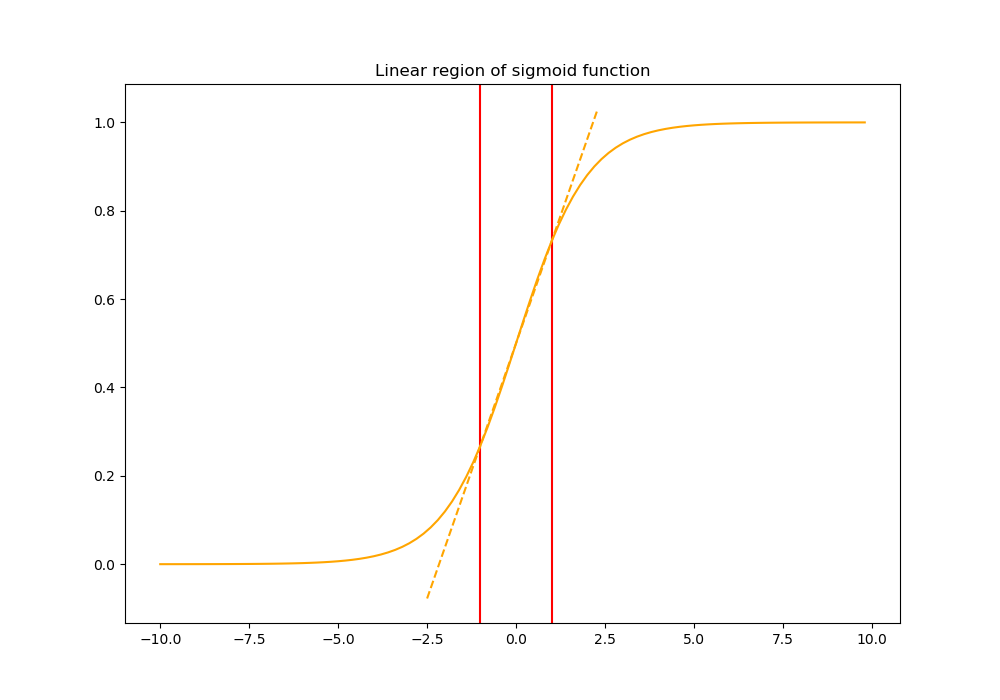
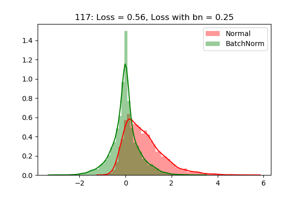
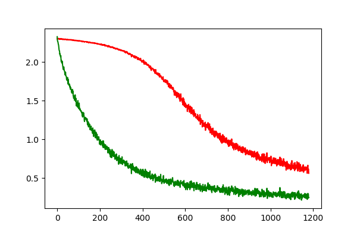

# Batch normalization

One of the main assumptions made when training learning systems is to suppos that the distribution of the inputs stays the same throughout training. For linear models, which simply map input data to some appropriate outputs, this condition is always satisfied but it is not the case when dealing with Neural Networks which are composed of several layers stacked on top of each other. 

In such architecture, each layers inputs are affected by the parameters of all preceding layers (small changes to the network parameters amplify as the network becomes deeper). As a consequence, a small change made during the backpropagation step within a layer can produce a huge variation of the inputs of another layer and at the end change feature maps distribution. During the training, each layer needs to continuously adapt to the new distribution obtained from the previous one and this slows down the convergence.

Batch normalization [1] overcomes this issue and make the training more efficient at the same time by reducing covariance shift within internal layers (change in the distribution of network activations due to the change in network parameters during training) during the course of training and with the advantages of working with batches.

### This article will cover the following

- How batch normalization can reduce internal covariance shift and how this can improve the training of a Neural Network.
- How to implement a batch normalization layer in PyTorch.
- Some simple experiments showing the advantages of using batch normalization.

## 1. Reduce internal covariance shift via mini-batch statistics

One way to reduce remove the ill effects of the internal covariance shift within a Neural Network is to normalize layers inputs. This operation not only enforces inputs to have the same distribution but also whitens each of them. This method is motivated by some studies [3,4] showing that the network training converges faster if its inputs are whitened and as a consequence, enforcing the whithening of the inputs of each layers is a desirable property for the network.

However, the full whitening of each layer’s inputs is costly and not fully differentiable. Batch normalization overcomes this issue by considering two assumptions:

- instead of whitening the features in layer inputs and outputs jointly, we will normalize each scalar feature independently (by setting the mean of zero and the variance of 1).
- Instead of using the entire dataset to normalize activations, we use mini-batches as *each mini-batch produces estimates of the mean and variance* of each activation.

For a layer with d-dimentional inputs x = $(x^{(1)} ... x^{(d)})$ we obtain the normalization with the following formulae (with expectation and variance computed over a batch B): 
$$
\hat{x}^{(k)} = \frac{x^{(k)} - \text{E}[x^{(k)}]_{\mathcal{B}}}{\sqrt{\text{Var}[x^{(k)}]_{\mathcal{B}}}}
$$


However, simply normalizing each input of a layer may change what the layer can represent. For instance, normalizing the inputs of a sigmoid would constrain them to the linear regime of the nonlinearity. Such a behavior is not desirable for the network as it will reduce his representative power (it would become equivalent to a single single layer network).



To address this, batch normalization also ensures that the transformation inserted in the network can represent the identity transform (the model still learns some parameters at each layer that adjust the activations recieved from the previous layer without linear mapping) . This is accomplished by introducing a pair of learnable parameters gamma_k and beta_k  which scale and shift the nomalized value according to what the model learns.

At the end, the resulting layers inputs (based on previous layer outputs x) are given by:
$$
y^{(k)} = \gamma^{(k)} \hat{x}^{(k)} + \beta^{(k)}
$$


## 2. Batch normalization algorithm


### During training

#### Fully connected layers

```python
mean = torch.mean(X, axis=0)
variance = torch.mean((X-mean)**2, axis=0)
X_hat = (X-mean) * 1.0 /torch.sqrt(variance + eps)
out = gamma * X_hat + beta
```

#### Convolutional layers

```python
N, C, H, W = X.shape
mean = torch.mean(X, axis = (0, 2, 3))
variance = torch.mean((X - mean.reshape((1, C, 1, 1))) ** 2, axis=(0, 2, 3))
X_hat = (X - mean.reshape((1, C, 1, 1))) * 1.0 / torch.sqrt(variance.reshape((1, C, 1, 1)) + eps)
out = gamma.reshape((1, C, 1, 1)) * X_hat + beta.reshape((1, C, 1, 1))
```


### During inference

During inference we want the output of our network to depend only on the input and so we cannot consider the statistics made on the batches that we considered previously (they are related to the batch so they change depending on the data). In order to ensure that we have a fixed expectation and variance, we need to compute these values using the whole dataset instead of considering only batches. However, computing these statistics for all the dataset is quite expensive in terms of time and computation.

The approached proposed in [1] is to use moving statistics that we compute during training. We adjust the importance of the expectation computed on the current batch with a parameter beta (momentum):
$$
\text{E}[x]_{\mathcal{B} \in \mathcal{X}} = (1 - \beta) . \text{E}[x]_{\mathcal{B}_i} + \beta .\text{E}[x]_{\mathcal{B}_{i-1, i-2, ...}}
$$

$$
\text{V}[x]_{\mathcal{B} \in \mathcal{X}} = (1 - \beta) . \text{V}[x]_{\mathcal{B}_i} + \beta .\text{V}[x]_{\mathcal{B}_{i-1, i-2, ...}}
$$

This moving average is stored in a global variable that is updated during the training phase.

### Final module

```python
class CustomBatchNorm(nn.Module):

    def __init__(self, in_size, momentum=0.9, eps = 1e-5):
        super(CustomBatchNorm, self).__init__()
        
        self.momentum = momentum
        self.insize = in_size
        self.eps = eps
        
        U = uniform.Uniform(torch.tensor([0.0]), torch.tensor([1.0]))
        self.gamma = nn.Parameter(U.sample(torch.Size([self.insize])).view(self.insize))
        self.beta = nn.Parameter(torch.zeros(self.insize))
            
        self.register_buffer('running_mean', torch.zeros(self.insize))
        self.register_buffer('running_var', torch.ones(self.insize))
        
        self.running_mean.zero_()
        self.running_var.fill_(1)

    def forward(self, input):
        
        X = input

        if len(X.shape) not in (2, 4):
            raise ValueError("only support dense or 2dconv")
        
        # dense layer
        elif len(X.shape) == 2:
            if self.training:
                mean = torch.mean(X, axis=0)
                variance = torch.mean((X-mean)**2, axis=0)
                
                self.running_mean = (self.momentum * self.running_mean) + (1.0-self.momentum) * mean
                self.running_var = (self.momentum * self.running_var) + (1.0-self.momentum) * (input.shape[0]/(input.shape[0]-1)*variance)
            
            else:
                mean = self.running_mean
                variance = self.running_var
                
            X_hat = (X-mean) * 1.0 /torch.sqrt(variance + self.eps)
            out = self.gamma * X_hat + self.beta
  
				# convolutional layer
        elif len(X.shape) == 4:
            if self.training:
                N, C, H, W = X.shape
                mean = torch.mean(X, axis = (0, 2, 3))
                variance = torch.mean((X - mean.reshape((1, C, 1, 1))) ** 2, axis=(0, 2, 3))
                
                self.running_mean = (self.momentum * self.running_mean) + (1.0-self.momentum) * mean
                self.running_var = (self.momentum * self.running_var) + (1.0-self.momentum) * (input.shape[0]/(input.shape[0]-1)*variance)
            else:
                mean = self.running_mean
                var = self.running_var
                
            X_hat = (X - mean.reshape((1, C, 1, 1))) * 1.0 / torch.sqrt(variance.reshape((1, C, 1, 1)) + self.eps)
            out = self.gamma.reshape((1, C, 1, 1)) * X_hat + self.beta.reshape((1, C, 1, 1))
        
        return out
```


## 3. Experiments on MNIST

In order to see the effect of batch normalization on training, we can compare the convergence rate between a simple Neural Network without batch normalization and an other one with batch normalization.

In order to keep things simple, we train these networks on the MNIST [3] dataset.

### Network architecture without Batch Norm

```python
class SimpleNet(nn.Module):
    def __init__(self):
        super(SimpleNet, self).__init__()
        self.classifier = nn.Sequential(
            nn.Linear(28 * 28, 64),
            nn.ReLU(),
            nn.Linear(64, 128),
            nn.ReLU(),
            nn.Linear(128, 10)
        )
        
    def forward(self, x):
        x = x.view(x.size(0), -1)
        x = self.classifier(x)
        return x
```


### Network architecture with Batch Norm

```python
class SimpleNetBN(nn.Module):
    def __init__(self):
        super(SimpleNetBN, self).__init__()
        self.classifier = nn.Sequential(
            nn.Linear(28 * 28, 64),
            CustomBatchNorm(64),
            nn.ReLU(),
            nn.Linear(64, 128),
            CustomBatchNorm(128),
            nn.ReLU(),
            nn.Linear(128, 10)
        )
        
    def forward(self, x):
        x = x.view(x.size(0), -1)
        x = self.classifier(x)
        return x
```


### Results

The following figure shows the distribution of activations after the first layer of our `SimpleNet`. We can see that the activation distribution with batch norm is still gaussian (with a small scale and shift learned during training) even after 20 epochs of training.



We can also see great improvements in term of convergence rates. The green curve (with batch normalization) shows that we can converge much faster to an optimal solution with normalization than without batch normalization.




## Conclusion

### Advantages of using batch normalisation for training

- The gradient of the loss over a mini-batch is an estimate of the gradient over the training set, whose quality improves as the batch size increases.
- The computation over a batch size can be much more efficient than multiple computations for individual examples due to the parallelism afforded by GPUs.
- Using batch normalization at each layer to reduce internal covariate shift greatly improves the learning efficiency of the networks.

## References

[1] Ioffe, Sergey, and Christian Szegedy. "Batch normalization: Accelerating deep network training by reducing internal covariate shift." *arXiv preprint arXiv:1502.03167* (2015).

[2] Shimodaira, Hidetoshi. "Improving predictive inference under covariate shift by weighting the log-likelihood function." *Journal of statistical planning and inference* 90.2 (2000): 227-244.

[3] MNIST dataset, http://yann.lecun.com/exdb/mnist/
