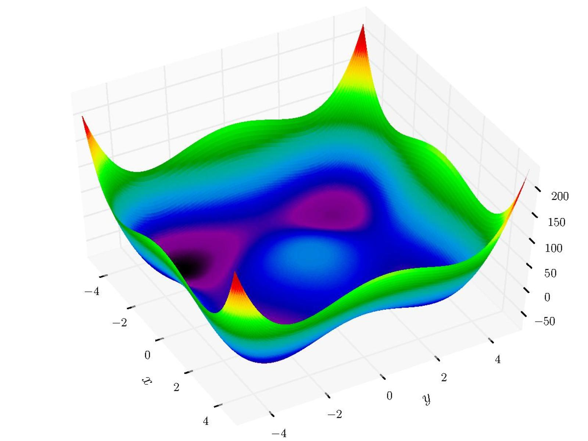
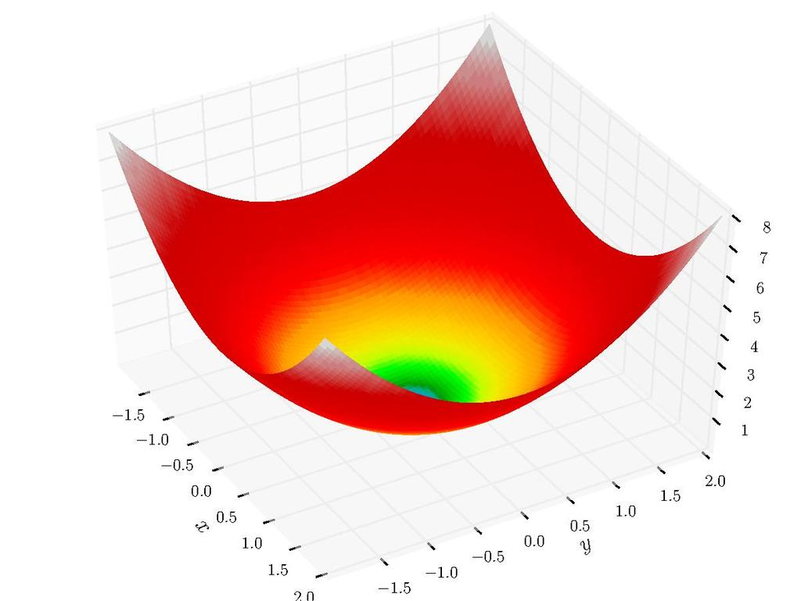

# Understanding convex optimisation in Machine Learning

#### Discover some of the common convex optimization algorithms and why they are so important in Machine Leaning and Deep Learning.

All of us have been exposed to an optimization problem in our every day life. Wether it was to find the fastest route to go to work on your GPS, to find the next movie that you could like on Netflix or to estimate the price of a house on a specialized website. All these applications are, in a manner, solving the same kind of problem: finding the best possible solution from a set of choices under some constrains.

Such problem can be found in a lot of different disciplines and in many applications ranging from applied mathematics, to science, engineering, economics & management. 

They usually involve three main components :

- A set of choices, from wich we can pick to find the best.
- A criteria, which is usually a function called the cost function that measures the cost of choosing a given solution.
- A set of constrains that needs to be met in order for the solution to be valid.

This area is broad and as this article is not intended to be a detailed course of optimization (*I will give you some ressources at the end of the article if you want to know more*) we will only focus on a specific part of this area which is optimization of convex function and its applications in the field of Machine Learning.

**This article will cover the following**

- What is convex optimization
- How convex optimization helps solving Machine Learning problems
- What are the most common optimization algorithms and how to implement them
- Some experiments showing the performance of different methods

## 1. An introduction to convex optimization

As mentionned earlier, an optimization problem is an abstraction of the problem of making the best possible choice of a vector in a n-dimensional space from a set of candidate choices. It can be written in the following form:
$$
\begin{aligned}
\min_{x} \quad & f_0(x)\\
\textrm{subject to} \quad & f_i(x) \leq b_i , i \in \{1,n\}\\
\end{aligned}
$$
The choice made is represented by the variable x, the objective function is f0 and the constaints are represented by the inequalities (fi(x)≤ bi). A solution of the optimization problem given here corresponds to a choice that has minimum cost (or maximum utility), among all choices that meet the given requirements.

One important thing to notice here is that we are talking about AN optimal solution not THE optimal solution. Indeed, in the general case, there can be tons of different solution depending on the area of the solutions that we explore, the constrains that we have and so one.

(present convex optimisation)

  

    
    
    <figcaption><bold>Figure</bold> Non-convex (left) vs convex (right) functions<figcaption>
  

## 2. Convex optimization in Machine Learning

Many fundamental convex optimization problems for machine learning take the following form: 
$$
\min_{x \in \mathbb{R}^n} \sum_i^m fi(x) + \lambda R(x)
$$
where the functions f1, . . . , fm, R are convex and λ ≥ 0 is a fixed parameter. 

The interpretation is that fi(x) represents the cost of using x on the i th element of some data set, and R(x) is a regularization term which enforces some ”simplicity” in x. 

In all cases one has a data set of the form (wi , yi) ∈ Rn × Y,  and the cost function fi depends only on the pair (wi , yi):

- In classification we usually have Y = {−1, 1}. 
  - Taking fi(x) = max(0, 1 − yix >wi) (the so-called hinge loss) and R(x) = ||x||^2 one obtains the SVM problem. 
  - On the other hand taking fi(x) = log(1+exp(−yix >wi)) (the logistic loss) and again R(x) = kxk 2 2 one obtains the logistic regression problem. 

- In regression one has Y = R. Taking fi(x) = (x >wi − yi) 2 and R(x) = 0 one obtains the vanilla least-squares problem which can be rewritten in vector notation as 

min x∈Rn kW x − Y k 2 2 , 

where W ∈ R m×n is the matrix with w > i on the i th row and Y = (y1, . . . , yn) >. With R(x) = kxk 2 2 one obtains the ridge regression problem, while with R(x) = kxk1 this is the LASSO problem. 1.2.

In our last example the design variable x is best viewed as a matrix, and thus we denote it by a capital letter X. Here our data set consists of observations of some of the entries of an unknown matrix Y , and we want to ”complete” the unobserved entries of Y in such a way that the resulting matrix is ”simple” (in the sense that it has low rank). After some massaging (see Cand`es and Recht [2009]) the matrix completion problem can be formulated as follows: 

min. Tr(X) s.t. X ∈ R n×n , X> = X, X  0, Xi,j = Yi,j for (i, j) ∈ Ω, 

where Ω ⊂ [n] 2 and (Yi,j )(i,j)∈Ω are given

## 3. Common optimization algorithms

**Gradient Descent**

**Accelerated Gradient Descent**

**Adaptative Gradient Descent (Adagrad)**

**RMS prop**

**Adaptative Moment Estimation (ADAM)**

## 4. Experiments

Some convex optimization problems for machine learning:

