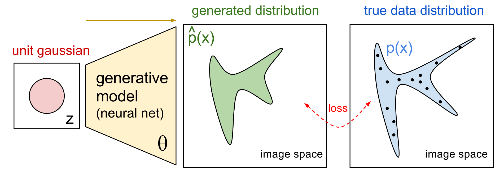

# Generative models

Generative models are a class of models for unsupervised learning that given a training dataset will try to generate new samples from the same distribution. The dataset used for training is considered as a set of samples taken from a particular data distibution and the model that we train is learning to map a simpler distribution (Gaussian distribution) from which we can easily sample new data to this more complex one. As the model has a significantly lower number of parameters than the dataset that we use for training,  the model is forced to discover and efficiently internalize the essence of the data in order to generate it.

Internally, the model is a function with parameters θ, and tweaking these parameters will tweak the generated distribution of images. The goal during training is then to find parameters θ that produce a distribution that closely matches the true data distribution (for example, by having a small KL divergence loss). 

## Variational Auto Encoders (VAE)

VAE aims at maximizing the lower bound of the data log-likelihood

### Related papers

- An Introduction to Variational Auto Encoders
- Tutorial on Variational Auto Encoder
- Auto-Encoding Variational Bayes
- Improved Variational Inference with Inversed Autoregressive Flow
- Data Analysis with Latent Variable Models

## Generative adverserial Netwoks (GAN)

GAN aims at achieving an equilibrium between Generator and Discriminator

### Related papers

- Generative Adverserial Nets
- Improved Technics for Training GANs
- Variational Approaches for Auto Encoding GANs
- Autoencoding Beyond Pixels using Learned Similarity Metrics

## Autoregressive models

### Related papers

- Pixel Recurrent Neural Network

